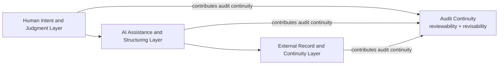

# Structural Drift in AI-Assisted Knowledge Work: A Research Note on Workflow Reviewability and Audit Continuity

S. Meta

May 2026

Initial public release / Public research note

Conceptual framework / research note with illustrative vignette

## Abstract

Long-horizon human-AI research workflows create risks that single-output evaluation cannot detect. As collaboration extends across multiple sessions, models, documents, and records, the research process may suffer structural drift: role boundaries blur, context decays, provisional claims harden into conclusions, and later reviewers can no longer reconstruct how key claims were formed. This note proposes a Tri-Layer Architecture for preserving audit continuity in such workflows by distinguishing among human judgment, AI assistance, and external records.

Building on this architecture, the note introduces Ambient Alignment Sync (AAS) — a workflow-level structural concept, not a claim about model-internal alignment — to describe cases in which these layers remain coherently separated and reviewable over time. AAS does not audit whether an AI model is internally aligned; it audits whether the human-AI workflow remains structurally auditable. An illustrative vignette demonstrates how structural drift unfolds when a provisional hypothesis becomes treated as fact. The note further identifies failure modes such as context drift, role confusion, claim inflation, record loss, and revision failure, while clarifying the limits of bounded archive reconstruction.

It does not claim AI consciousness, agency, authorship, formal certification, or correctness guarantees. The contribution is a Tri-Layer Architecture and associated audit lens that make reviewability, revisability, and claim provenance first-class concerns in long-horizon human-AI research.

**Keywords:** structural drift; human-AI collaboration; audit continuity; workflow reviewability; claim provenance; human-AI research workflows; AI accountability; distributed cognition; provenance; collaborative research

## Note on Scope

This note is maintained as a public research note and concept-development record. It introduces structural drift as a workflow-level risk in long-horizon human-AI research and proposes a Tri-Layer Architecture for preserving audit continuity across human judgment, AI assistance, and external records.

Ambient Alignment Sync (AAS) is presented as a workflow-level condition for maintaining reviewability and revisability over time. It is not a claim about model-internal AI alignment, consciousness, agency, authorship, formal certification, compliance assurance, or correctness guarantees.

The contribution of this note is conceptual and methodological: it asks whether long-horizon human-AI research workflows remain structurally reviewable and revisable as claims, roles, records, and revision conditions move across time, tools, models, documents, and archives.

This note is part of a public research archive developed through long-term dialogue with AI and concept formation. AI assistance was used to organize the content.

## 1. Introduction

Human-AI research collaboration is increasingly moving beyond isolated prompt-response interactions. Researchers now use AI systems across multiple sessions, models, documents, drafts, archives, and stages of conceptual development. In such settings, the central risk is not only that a single AI output may be factually wrong. A deeper risk is that the workflow itself may gradually lose structural integrity while individual outputs continue to appear locally useful.

This note describes that risk as structural drift. Structural drift occurs when the role boundaries, context, records, and revision conditions of a long-horizon human-AI research workflow become less visible or less reconstructable over time. A provisional hypothesis may become treated as an established claim. An AI-assisted inference may become difficult to distinguish from human judgment. Earlier constraints may disappear from later drafts. Records may become too fragmented to support later review. In each case, the problem is not merely output error, but loss of workflow reviewability.

Existing approaches to human-AI evaluation often focus on local interaction quality, factual accuracy, usability, explainability, or responsible AI governance. These remain important. However, long-horizon research workflows require an additional question: does the collaborative process remain reviewable and revisable as it extends across time, tools, models, and records?

This note proposes a Tri-Layer Architecture for addressing this question. The architecture distinguishes among three layers: human intent and judgment, AI assistance and structuring, and external record and continuity. The purpose of this separation is not to make human-AI collaboration rigid, but to preserve the visibility of roles, claims, and records as research develops over time.

Building on this architecture, the note introduces Ambient Alignment Sync (AAS) as a workflow-level condition in which human judgment, AI assistance, and external records remain coherently separated and reviewable over time. The term does not refer to the AI model’s internal state. AAS does not audit whether the AI is aligned; it audits whether the human-AI workflow remains structurally auditable.

In this note, “audit” refers to structured reviewability of workflow integrity. It does not mean formal certification, legal assurance, compliance verification, or guaranteed correctness. The object of audit is not the model’s internal alignment, consciousness, agency, or authorship. The object of audit is the continuity and reviewability of the collaborative research workflow.

The note makes one primary contribution and two supporting contributions. The primary contribution is to name structural drift as a workflow-level risk in long-horizon human-AI research: a form of degradation in which roles blur, context decays, claim status inflates, records fragment, and revision conditions disappear even while local outputs remain useful. The first supporting contribution is a Tri-Layer Architecture that separates human judgment, AI assistance, and external records as the basis for preserving audit continuity. The second supporting contribution is Ambient Alignment Sync, a bounded workflow-level condition and audit lens for assessing whether claims, roles, records, and revision conditions remain reviewable over time.

## 2. Structural Drift in Long-Horizon Human-AI Research

Structural drift is the gradual degradation of workflow structure across extended human-AI collaboration. It is distinct from hallucination, factual error, or poor usability, although it may interact with all three. A workflow may produce many useful local outputs and still lose the ability to show how its claims were formed, revised, or justified.

Five failure modes are especially relevant to long-horizon research workflows.

First, context drift occurs when earlier assumptions, definitions, goals, or constraints are lost or distorted across sessions. This is especially likely when AI-generated summaries are reused as background context without preserving the uncertainty or scope of the original material.

Second, role confusion occurs when the boundary between human judgment and AI assistance becomes difficult to identify. The issue is not that AI assistance is illegitimate, but that later readers may be unable to distinguish between what the researcher decided and what the AI suggested.

Third, claim inflation occurs when provisional reasoning becomes treated as established knowledge. A hypothesis, interpretation, or AI-generated pattern may gradually harden into a claim without adequate evidentiary support. AI-generated prose can intensify this failure mode because fluent language often gives provisional reasoning the surface form of settled analysis.

Fourth, record loss occurs when the workflow no longer preserves enough external structure to reconstruct the origin, transformation, or status of a claim.

Fifth, revision failure occurs when prior conclusions persist even after new evidence, changed assumptions, or later review should have triggered revision.

These failure modes motivate the need for an audit framework that focuses not only on the correctness of individual outputs, but on the reviewability and revisability of the workflow that produces them.

## 3. Illustrative Failure Vignette: When a Provisional Hypothesis Becomes a Fact

To make structural drift more concrete, consider a hypothetical researcher conducting a literature review on a rapidly developing interdisciplinary topic. The review extends over three weeks and involves multiple AI-assisted sessions, several draft documents, and an expanding set of source notes.

In the first week, the researcher asks an AI system to summarize a small set of early papers and identify possible patterns. The AI suggests that several papers may imply a relationship between two concepts. The researcher treats this as a provisional hypothesis and continues the review. At this stage, the workflow remains relatively clear: the claim is tentative, the AI has assisted in pattern generation, and the researcher has not yet accepted the hypothesis as established.

In the second week, the researcher begins a new AI-assisted session using a different set of notes. The earlier provisional hypothesis is pasted into the new session as background context, but its uncertain status is not clearly marked. The AI then uses the hypothesis as an organizing premise for summarizing later material. The hypothesis now has a different role in the workflow. It no longer appears merely as a possible pattern; it begins to function as a background assumption.

By the third week, the researcher is drafting the paper. The provisional hypothesis now appears in the draft as if it were an established finding in the literature. The draft does not clearly show whether the claim originated from cited evidence, the researcher’s interpretation, or AI-assisted inference. When the researcher later tries to verify the claim, the relevant record is fragmented across sessions, notes, and drafts. The claim cannot be confidently reconstructed.

This vignette illustrates structural drift rather than a single factual error. The final claim may or may not be true. The more important point is that the workflow has lost the ability to show how the claim changed status over time. Several failure modes are visible.

First, context drift occurs because the original uncertainty surrounding the hypothesis is lost as it moves between sessions. Second, role confusion occurs because the boundary between AI-generated inference and human judgment becomes unclear. Third, claim inflation occurs because a provisional hypothesis becomes treated as an established claim. Fourth, record loss occurs because the chain from source evidence to draft claim is no longer reconstructable. Fifth, revision failure occurs because the workflow does not preserve a clear condition under which the hypothesis should be updated, weakened, or withdrawn.

The vignette therefore functions as a problem case. It shows how structural drift can occur before any framework is introduced for preventing or reviewing it. Later sections return to this vignette after developing the Tri-Layer Architecture.

## 4. Related Work

This note is situated at the intersection of human-AI collaboration, CSCW, distributed cognition, accountability, provenance, and qualitative process methodology. Its aim is not to replace these traditions, but to bring their concerns together around a specific problem: how long-horizon human-AI research workflows remain reviewable and revisable over time.

A first point of connection is the tradition of situated action, especially Suchman’s account of the gap between plans and situated activity (Suchman, 1987). Workflows are rarely executed exactly as pre-specified plans. In practice, goals, interpretations, and local actions change in response to the situation. This matters for human-AI research because long-horizon collaboration often develops through repeated adjustment: earlier assumptions are reused, prompts are reformulated, documents evolve, and AI-generated summaries are reintroduced into later sessions. AAS treats this situated evolution not as a defect, but as a source of audit risk when the changing status of claims, roles, and records becomes difficult to reconstruct.

A second point of connection is distributed cognition, especially Hutchins’s account of cognition as distributed across people, artifacts, tools, and environments (Hutchins, 1995). Long-horizon research does not occur solely inside the mind of an individual researcher. It is distributed across human judgment, AI-generated assistance, documents, citations, notes, version histories, and external archives. The Tri-Layer Architecture builds on this intuition by distinguishing human intent and judgment, AI assistance and structuring, and external record stabilization. The specific contribution of this note is to ask whether this distributed workflow remains structurally auditable over time.

A third connection is the CSCW literature on boundary objects and accountability, including Star and Griesemer’s account of boundary objects and Dourish’s work on accountability in interactive systems (Star & Griesemer, 1989; Dourish, 1997). External records such as draft documents, citations, summaries, and logs do more than store information. They coordinate meaning across roles, sessions, and later review. In long-horizon human-AI workflows, these records can function as boundary objects between human judgment, AI assistance, and subsequent reconstruction. However, when records are fragmented or ambiguous, they may fail to preserve the status of claims or the boundary between assistance and decision. AAS therefore treats record integrity as a central condition of audit continuity.

Work on data science collaboration further clarifies why trust and accountability cannot be reduced to technical outputs alone. Passi and Jackson’s study of corporate data science projects shows that trustworthy analytic work emerges through situated practices of skepticism, assessment, credibility negotiation, and translation among actors (Passi & Jackson, 2018). This is directly relevant to long-horizon human-AI research workflows, where claim status and role boundaries must be repeatedly negotiated as AI-generated summaries, human interpretations, and external records interact.

Human-AI interaction research provides another important background. Existing guidelines for human-AI interaction, such as those proposed by Amershi and colleagues (Amershi et al., 2019), emphasize issues such as user control, uncertainty, feedback, appropriate reliance, and recoverability. These concerns are highly relevant to AI-assisted research. However, many interaction-oriented frameworks focus primarily on local interaction moments or system behavior. AAS shifts the unit of analysis from the single interaction to the extended workflow. Its question is not only whether a user can understand or control an AI output at the moment of interaction, but whether a sequence of interactions remains reviewable and revisable after weeks or months of research activity.

Recent work on LLMs in scientific research and scholarly communication makes the workflow-level problem more urgent. Studies of LLM-supported scientific review and literature synthesis show growing interest in using models across research tasks rather than isolated question-answer interactions (Mishra et al., 2024; Scherbakov et al., 2025). At the same time, work on LLM-generated scientific summaries has found that models may overgeneralize research findings, producing conclusions broader than the source material supports (Peters & Chin-Yee, 2025). These findings strengthen the need for workflow-level structures that preserve claim status, source boundaries, and revision conditions rather than treating fluent AI-generated text as stable evidence.

AI governance and auditability frameworks also provide relevant background. Responsible AI frameworks, including risk-management approaches such as the NIST AI Risk Management Framework (National Institute of Standards and Technology, 2023), commonly address transparency, risk management, compliance, bias, accountability, and institutional governance. Reports on AI in science similarly emphasize responsible uptake, research integrity, transparency, and the changing role of AI in scientific practice (SAPEA, 2024; European Commission’s Group of Chief Scientific Advisors, 2024; Purificato et al., 2025). AAS is narrower and more workflow-specific. It does not certify the AI system, evaluate legal compliance, or provide formal assurance. Instead, it asks whether the human-AI research process itself preserves enough structure for later review: who judged, what the AI assisted with, where the evidence is located, which claims are provisional, and what conditions should trigger revision.

The external record layer also connects to work on provenance and information lineage in scientific workflows. Provenance research emphasizes the importance of recording the origin, derivation, transformation, and dependencies of data products and workflow outputs (Simmhan et al., 2005; Cuevas-Vicenttín et al., 2012; Stage et al., 2025). AAS extends this concern from data products to research claims in AI-assisted workflows: the question is not only where a dataset came from, but how a claim moved from source evidence to AI-assisted inference, human judgment, draft language, and later revision. This extension is conceptual rather than technical: AAS borrows the provenance concern with origin and transformation, but applies it to the epistemic status of claims rather than to computational pipeline outputs.

Finally, AAS connects to process theory and qualitative methodology, including Langley’s work on theorizing from process data and Yin’s case-study methodology (Langley, 1999; Yin, 2014). Longitudinal research frequently requires reconstructing processes from incomplete records. Such reconstruction must remain bounded: surviving records may support partial reconstruction of decisions, sequences, and transformations, but they cannot reveal hidden motives, undocumented interactions, or complete causal histories. AAS adopts this epistemic discipline through bounded archive reconstruction. It asks what the available records allow us to reconstruct, and where the limits of inference must be explicitly acknowledged.

Across these literatures, AAS contributes a focused conceptual lens for long-horizon human-AI research workflows. Situated action helps explain why workflows evolve; distributed cognition explains why reasoning is spread across humans, tools, and artifacts; boundary-object and CSCW accountability work explain why records matter; human-AI interaction research clarifies local interaction concerns; recent LLM research highlights new risks of fluent overgeneralization; governance frameworks emphasize accountability and risk; provenance work clarifies the importance of traceable lineage; and process methodology disciplines reconstruction over time. AAS brings these concerns together around a specific audit question: does the workflow remain structurally reviewable and revisable as collaboration extends across time, tools, models, and records?

## 5. Tri-Layer Architecture

The Tri-Layer Architecture is the primary structural proposal of this note. It distinguishes three layers that are often compressed in long-horizon human-AI research workflows: human intent and judgment, AI assistance and structuring, and external record and continuity. The purpose of the architecture is not to prescribe a rigid workflow, but to preserve the visibility of role boundaries, claim status, and review conditions over time.

## 5.1 Human Intent and Judgment Layer

The first layer is the human intent and judgment layer. This layer includes the researcher’s aims, interpretive authority, value judgments, responsibility, final acceptance or rejection of AI suggestions, and revision authority.

In long-horizon AI-assisted research, the human role is not limited to writing prompts. The researcher frames the research purpose, decides which claims matter, evaluates whether an AI-assisted inference should be accepted, and determines when prior conclusions must be revised. The human layer is therefore the layer of responsibility.

Structural drift occurs when this layer becomes obscured. For example, if an AI-generated inference is repeatedly reused in later drafts without a clear human decision accepting it, later readers may be unable to determine whether the claim was human-endorsed, AI-suggested, or merely carried forward by workflow inertia. Preserving the human judgment layer means preserving evidence of when and how the researcher accepted, rejected, weakened, or revised claims.

## 5.2 AI Assistance and Structuring Layer

The second layer is the AI assistance and structuring layer. This layer includes summarization, drafting, comparison, critique, reformulation, pattern identification, and structural assistance.

AI systems can substantially improve the speed and organization of research workflows. They can help identify patterns, compare alternatives, generate outlines, refine prose, and surface possible weaknesses. However, in the Tri-Layer Architecture, these contributions remain assistance. They do not become final judgment, authorship responsibility, or evidence by themselves.

The audit issue is not whether AI assistance is used. The issue is whether the workflow preserves the status of that assistance. A generated summary should not silently become an evidentiary conclusion. A suggested pattern should not automatically become a human-endorsed claim. A critique should not become a recorded rejection unless the researcher accepts it as such. The AI assistance layer is therefore structurally useful only when its outputs remain distinguishable from human judgment and external evidence.

## 5.3 External Record and Continuity Layer

The third layer is the external record and continuity layer. This layer includes source documents, citations, notes, versioned drafts, logs, summaries, decision records, and archives. It stabilizes the workflow across time and makes later review possible.

In long-horizon research, memory cannot remain internal. Claims move across sessions, documents, drafts, and contexts. Without external records, the workflow becomes vulnerable to reconstruction failure. Later reviewers — including the original researcher — may be unable to determine where a claim came from, what its status was, or why it changed.

The external record layer is therefore not merely storage. It performs a continuity function. It preserves the relation among sources, AI assistance, human judgment, and revision conditions. The third layer does not perform the audit by itself; rather, it stabilizes the records that allow the workflow as a whole to remain auditable.

## 5.4 Layer Separation and Audit Continuity

The three layers are mutually dependent but analytically distinct. Human judgment gives direction and responsibility. AI assistance provides generative and structuring support. External records stabilize continuity and enable review. Audit continuity depends on the ability to keep these layers distinguishable even as they interact.

A workflow does not need perfect records to be auditable. Nor does it need to eliminate ambiguity entirely. The relevant question is whether the workflow preserves enough structure for later review and revision. Can a later reviewer tell which claims were sourced, which were inferred, which were provisional, which were accepted, and which should be revisited? If the answer becomes no, structural drift has overtaken the workflow.

The Tri-Layer Architecture therefore functions as an organizing lens for long-horizon human-AI research. It shifts attention from isolated outputs to the structural conditions that make extended collaboration reviewable over time.

**Figure 1. Tri-Layer Architecture for Audit Continuity**

The Tri-Layer Architecture separates human judgment, AI assistance, and external records. Audit continuity does not flow from the external record layer alone; it emerges from the continued separability and coordination of all three layers.

## 6. Vignette Revisited: Tri-Layer Separation and Claim Provenance

We return to the literature review scenario introduced in Section 3. Recall that a provisional hypothesis — generated through AI-assisted pattern identification in the first week — had entered the third-week draft as if it were an established literature finding, with its source, status, and uncertainty conditions no longer clearly traceable.

The problem was not simply that the AI suggested a weak hypothesis. The deeper issue was that the workflow failed to preserve the claim’s origin, status, and revision conditions as it moved across sessions and drafts.

A Tri-Layer Architecture would not guarantee that the final claim is true. It would instead preserve the claim’s provenance in a more reviewable form. At the human intent and judgment layer, the researcher would mark the hypothesis as provisional and retain responsibility for accepting, rejecting, or revising it. At the AI assistance and structuring layer, AI-generated summaries and inferred patterns would remain labeled as assistance rather than as established findings. At the external record and continuity layer, the source papers, AI-generated interpretations, human decisions, and revision conditions would be preserved in a way that allows later review.

The value of this structure is not that it prevents all error. Its value is that it keeps the collaborative workflow structurally auditable. The researcher can later ask: where did this claim come from, who accepted it, what evidence supports it, what uncertainty remains, and what would require revision?

**Table 1. Claim transformation with and without Tri-Layer separation.**

| **Workflow Moment**               | **Without Layer Separation**                            | **With Tri-Layer Separation**                                |
|-----------------------------------|---------------------------------------------------------|--------------------------------------------------------------|
| AI identifies a pattern           | The pattern is reused as background context.            | The pattern is labeled as AI-assisted provisional inference. |
| Researcher accepts or modifies it | Acceptance is implicit or undocumented.                 | Human judgment is recorded explicitly.                       |
| Later draft uses the claim        | The claim appears as an established literature finding. | Claim status remains provisional until sourced and accepted. |
| Reviewer checks the claim         | Origin is fragmented or unclear.                        | Source, inference, and decision trail remain visible.        |
| New evidence appears              | Earlier claim persists by inertia.                      | Revision condition triggers review.                          |

This revisited vignette also clarifies why claim provenance matters. In AI-assisted research, a claim may travel through several transformations: source evidence, AI summary, AI-generated pattern, human interpretation, draft language, and later revision. AAS treats this movement as part of the object of review.

## 7. Ambient Alignment Sync as a Workflow-Level Condition

Ambient Alignment Sync (AAS) is introduced in this note as a workflow-level condition, not as a claim about the internal state of an AI model. The term names a state in which human judgment, AI assistance, and external records remain coherently separated and reviewable over time.

This distinction is essential. In contemporary AI discourse, “alignment” often refers to whether an AI system’s behavior, goals, or outputs are aligned with human values or intentions. AAS does not use the term in that model-internal sense. It does not claim that the AI system has intentions, agency, consciousness, authorship, or hidden agreement with the user. Instead, AAS refers to the observable structure of a collaborative workflow.

A workflow can be described as approaching AAS when the following conditions are visible in the record. First, the role of the human researcher remains distinguishable from the role of AI assistance. Second, the context of the project remains continuous enough for earlier assumptions, definitions, and constraints to be understood later. Third, records preserve the origin and status of important claims. Fourth, provisional interpretations remain distinguishable from established conclusions. Fifth, the workflow retains conditions under which earlier claims should be revised.

AAS is therefore not a guarantee of correctness. A workflow may preserve AAS and still contain factual errors. Conversely, a workflow may produce a correct statement while failing to preserve the record structure necessary to show how that statement was reached. The contribution of AAS is to focus attention on reviewability and revisability as properties of the workflow, rather than on correctness as a property of an isolated output.

This framing also avoids treating human-AI collaboration as a simple dyad between a user and a model. Long-horizon research workflows depend on external records: notes, citations, drafts, summaries, archives, and version histories. These records are not secondary artifacts. They are part of the structure that allows the collaboration to remain legible over time. AAS therefore refers to a relation among three layers: human judgment, AI assistance, and external record stabilization.

The term “ambient” is used to emphasize that AAS is not produced by any single action. It is maintained through an accumulation of workflow practices — labeling, versioning, record-keeping, source tracing, and revision habits — all of which should remain externally visible in the workflow’s records. This makes AAS observable through workflow structure rather than hidden in the AI model or the researcher’s internal state. “Ambient” therefore refers to the surrounding workflow environment, not to a background process inside the AI system.

AAS should therefore be read as a proposed descriptive lens. It helps identify whether a long-horizon human-AI research workflow remains structurally auditable. It does not certify that the workflow is correct, complete, unbiased, or universally valid.

## 8. AAS as a Structural Audit Lens

If AAS names a workflow-level condition, then the corresponding audit question is straightforward: does the workflow remain structurally auditable over time? In this note, “audit” refers to structured reviewability of workflow integrity. It does not mean legal certification, compliance assurance, formal verification, or guaranteed correctness.

AAS differs from output evaluation because its unit of analysis is not a single answer, claim, or generated text. It differs from prompt engineering because its concern is not primarily how to obtain a better immediate response. It differs from usability testing because its central question is not whether the user can complete a task in a given interface. AAS instead focuses on the continuity of a research workflow across time, tools, models, documents, and revisions.

The audit dimensions below are expressed as review questions because AAS does not certify outcomes; it structures what later reviewers should be able to inspect.

## 8.1 Role Boundary Review

The first dimension asks whether human judgment and AI assistance remain distinguishable. In long-horizon research, AI systems may summarize evidence, propose interpretations, draft language, or identify patterns. These activities can be valuable, but their status must remain visible. A workflow becomes less auditable when AI-generated suggestions are carried forward as if they were human judgments or source-supported conclusions.

Role boundary review does not determine whether the human researcher made the right decision. It asks whether the workflow preserves enough structure to identify where human responsibility entered the process.

## 8.2 Context Preservation Review

The second dimension asks whether the project’s goals, assumptions, definitions, constraints, and prior decisions remain visible across time. Context drift is especially likely when work is spread across multiple sessions or models. A summary generated in one session may be reused in another without preserving its limitations. A term may shift meaning across drafts. A constraint may disappear because it was never externalized.

Context preservation review does not require perfect continuity. Long-horizon research naturally evolves. The question is whether the workflow preserves enough context for later reviewers to understand how and why it evolved.

## 8.3 Claim Status Review

The third dimension asks whether the status of claims remains visible. Claims may be observed facts, cited statements, interpretations, hypotheses, provisional inferences, or accepted conclusions. In AI-assisted workflows, fluent generated prose can make these categories appear more settled than they are.

Claim status review therefore asks whether the workflow distinguishes between what was sourced, what was inferred, what was proposed, what was accepted, and what remains uncertain. It does not decide whether a claim is true. It asks whether the claim’s status is reviewable.

## 8.4 Record and Reconstruction Review

The fourth dimension asks whether the workflow leaves enough external record to reconstruct the origin and transformation of important claims. Relevant records may include source documents, notes, drafts, citations, summaries, version histories, and explicit decision records.

Record and reconstruction review does not assume that all history can be recovered. It asks what can be reconstructed from available records, where the record is incomplete, and which claims cannot be responsibly traced.

## 8.5 Revision Discipline Review

The fifth dimension asks whether the workflow preserves conditions for updating, weakening, or withdrawing prior claims. Long-horizon research often involves changing evidence, definitions, and project goals. Without revision discipline, earlier claims may persist through inertia rather than continued support.

Revision discipline review asks whether the workflow makes revision possible. It does not require that every future revision be anticipated. It requires that the workflow preserve enough uncertainty, evidence, and decision context for revision to remain available.

## 8.6 What the Audit Lens Does Not Do

The AAS audit lens is deliberately bounded. It does not certify correctness. It does not verify the AI model’s internal alignment. It does not assign legal responsibility. It does not produce a universal score for workflow quality. It does not replace domain expertise, source verification, peer review, or methodological judgment.

Its more modest contribution is to make a specific class of risk visible: the gradual loss of reviewability in extended human-AI research collaboration. In this sense, AAS audits whether the workflow remains auditable.

## 9. Bounded Archive Reconstruction and Limits

Long-horizon human-AI research workflows often leave incomplete records. Conversations may be missing, drafts may be overwritten, intermediate reasoning may not be preserved, and later summaries may compress earlier decisions. Any framework that evaluates such workflows must therefore avoid claiming total reconstruction.

Bounded archive reconstruction is the discipline of stating what can and cannot be inferred from available records. It recognizes that records are useful but partial. They may support reconstruction of sequences, claim transformations, role patterns, and revision points. They cannot reveal all intentions, all causal pathways, all undocumented interactions, or the internal states of an AI model.

This distinction is central to AAS. AAS depends on external records, but it does not assume that records provide complete access to the past. Instead, it asks whether the workflow preserves enough structure to support responsible review. Where records are sufficient, the reviewer may reconstruct how a claim emerged, how its status changed, and what evidence or judgment supported it. Where records are insufficient, the reviewer must mark the limit rather than infer beyond it.

For example, in the vignette above, a later reviewer may be able to see that a claim appeared first as a provisional hypothesis and later as a draft conclusion. If the intermediate records are preserved, the reviewer may reconstruct the transformation and evaluate whether it was justified. If the records are missing, the reviewer cannot responsibly claim to know whether the transformation was caused by source evidence, human interpretation, AI inference, or simple repetition. The correct conclusion is not speculation, but bounded uncertainty.

The same discipline applies to AI-related claims. AAS does not infer that the AI system intended, understood, endorsed, or authored a claim. It also does not infer that the AI system was internally aligned with the researcher. The framework treats AI contributions as observable artifacts within a workflow: texts, summaries, suggestions, classifications, critiques, or reformulations. Their significance depends on how the human researcher used them and how the workflow recorded them.

Bounded reconstruction also protects against overstating the framework itself. If a workflow lacks sufficient external records, AAS cannot retroactively make it auditable. It can only identify where audit continuity was preserved and where it failed. In this sense, AAS is not a recovery mechanism for all lost context. It is a lens for evaluating whether the conditions for responsible reconstruction were maintained.

The limits are therefore part of the framework, not a weakness to be hidden. AAS is strongest when it can say not only what is visible, but also what is not visible; not only what can be reconstructed, but also where reconstruction must stop.

## 10. Discussion

The framework described in this note is intentionally bounded. It does not attempt to provide a universal theory of human-AI collaboration, a technical architecture for AI systems, or a formal certification method. Its contribution is narrower: it offers a structural lens for examining whether long-horizon human-AI research workflows remain reviewable and revisable over time.

## 10.1 Beyond Output Evaluation

Much evaluation of AI-assisted work begins with the output: is the answer correct, useful, harmful, biased, cited, or well-written? These questions remain necessary. AAS does not replace source verification, factual checking, peer review, or domain expertise.

However, output evaluation alone cannot detect all workflow risks. A locally useful output may still contribute to structural drift if it obscures the status of a claim, weakens role boundaries, or enters later drafts without traceable context. The relevant question is therefore not only whether an output is good, but whether the workflow remains capable of explaining how that output was produced, accepted, revised, or rejected.

## 10.2 Beyond Prompt Engineering

AAS also differs from prompt engineering. Prompt engineering often focuses on improving the immediate quality of AI responses by refining instructions, context, format, or constraints. These practices can be useful within long-horizon research workflows, but they do not by themselves guarantee audit continuity.

A well-designed prompt can produce a clear answer in a single session while the broader project still loses track of earlier assumptions, claim status, or revision conditions. AAS therefore shifts attention from the prompt-response unit to the extended workflow. It asks whether the sequence of interactions, documents, and decisions remains structurally reviewable.

## 10.3 Relation to HCI and CSCW Evaluation

AAS is also distinct from standard HCI evaluation methods such as usability testing, heuristic evaluation, or cognitive walkthroughs. Those methods often assess whether users can complete tasks effectively, whether interfaces support interaction, or whether systems follow design principles.

AAS asks a different question. It does not primarily evaluate interface usability or task completion. It evaluates whether a research workflow that unfolds across time preserves the structure necessary for later review. Its focus is longitudinal, reconstructive, and claim-centered. It is concerned with how claims move through human judgment, AI assistance, and external records.

The distinction can be summarized through six comparisons.

Compared with output fact-checking, AAS shifts attention from the factual correctness of an individual answer to whether the workflow remains reviewable over time.

Compared with prompt engineering, AAS shifts attention from immediate response quality to longitudinal workflow structure.

Compared with HCI usability evaluation, AAS focuses less on point-in-time task performance and more on claim status, record continuity, and reconstruction.

Compared with human-AI interaction guidelines, AAS extends the concern from interaction design patterns to records, claims, and revision across sessions.

Compared with responsible AI checklists, AAS operates as a workflow-level review lens rather than a certification framework.

AAS therefore treats the long-horizon human-AI research workflow itself as the primary unit of analysis, with reviewability, revisability, and structural continuity as its central concerns.

This does not make AAS a replacement for HCI or CSCW methods. Rather, it identifies a complementary unit of analysis: the long-horizon human-AI research workflow as a structure that can either preserve or lose audit continuity.

## 10.4 Relation to AI Governance and Responsible AI

Responsible AI and governance frameworks often emphasize transparency, accountability, risk management, compliance, fairness, and institutional responsibility. AAS shares the concern for accountability, but operates at a different level.

It does not certify a model, approve a system, or verify organizational compliance. Instead, it asks whether a particular research workflow preserves enough structure for its claims and decisions to be reviewed. In this sense, AAS can be understood as a workflow-level complement to broader governance concerns. It focuses on the microstructure of extended human-AI collaboration rather than the macrostructure of institutional AI governance.

## 10.5 Not Merely Note-Taking or Version Control

One possible objection is that AAS merely restates good note-taking, version control, or research documentation practices. The overlap is real but incomplete. Conventional records can preserve drafts and sources, but long-horizon AI-assisted workflows introduce additional risks: fluent generated prose can make provisional inferences appear settled; summaries can be transferred across sessions without their uncertainty conditions; and model-assisted reformulations can obscure whether a claim is sourced, inferred, or human-endorsed. AAS therefore does not replace ordinary documentation practices. It specifies why those practices must be extended to preserve claim status, role boundaries, and revision conditions in AI-assisted research.

Structured documentation tools, lab notebooks, and personal knowledge management systems can support the external record layer, but they do not by themselves enforce the claim-level and role-level distinctions that AAS foregrounds.

## 10.6 Implications for Practice

Although this note does not prescribe a full implementation protocol, the framework suggests several lightweight practices for researchers using AI over long periods. Researchers can mark provisional claims explicitly, distinguish AI-assisted inference from accepted human judgment, preserve records of how claims developed from source evidence to accepted conclusions, record why important claims were accepted or revised, and identify conditions under which claims should be revisited. These practices are not meant as certification procedures. They are ways of keeping the workflow reviewable enough for later scrutiny.

## 10.7 Use Cases and Scope

The framework is most relevant where human-AI collaboration is extended, iterative, and record-dependent. Examples include literature reviews, conceptual research, policy analysis, long-term drafting, interdisciplinary synthesis, and research programs that evolve across multiple documents and sessions.

The framework is less relevant to one-off interactions where there is little need for longitudinal continuity, and it is insufficient by itself for high-stakes factual, legal, medical, or scientific claims that require independent verification. AAS can help preserve the reviewability of a workflow, but it cannot substitute for domain-specific validation.

## 10.8 Limits and Future Work

Several limitations follow from the note’s conceptual scope. First, the framework has not yet been empirically tested across multiple research teams or institutional settings. Second, the audit dimensions are qualitative rather than metric-based. Third, the illustrative vignette demonstrates plausibility rather than empirical frequency. Fourth, the framework depends on the presence of external records; where records are absent, AAS can identify reconstruction limits but cannot recover lost context.

Future work could develop practical checklists, compare AAS-informed and non-AAS-informed workflows, examine how research teams maintain claim status over time, or explore how versioned records and AI interaction logs support bounded reconstruction. Future work could also investigate whether the five audit dimensions identified here are sufficient, or whether additional dimensions are needed in collaborative, institutional, or high-stakes settings.

The key point is that long-horizon human-AI research requires more than better answers. It requires structures that preserve the ability to ask later: what was claimed, by whom, on what basis, with what uncertainty, and under what conditions should it be revised?

## 11. Conclusion

Human-AI research workflows are increasingly extended across time, models, documents, and external records. In these settings, the central risk is not limited to isolated factual error or output quality. A workflow may produce locally useful outputs while gradually losing the structure needed to review, revise, and reconstruct its own claims.

This note has described that risk as structural drift. Structural drift appears when context decays, roles blur, claims inflate, records fragment, or revision conditions disappear. These failures are especially important in long-horizon research because the value of the work depends not only on what is produced, but on whether its claims remain traceable and revisable over time.

To address this problem, the note proposed a Tri-Layer Architecture that distinguishes among human intent and judgment, AI assistance and structuring, and external record and continuity. This separation does not make human-AI collaboration rigid. Rather, it helps preserve the visibility of responsibility, assistance, evidence, and revision across extended work.

The note then introduced Ambient Alignment Sync as a workflow-level condition in which these layers remain coherently separated and reviewable over time. AAS does not claim that an AI model is internally aligned, conscious, agentic, or authorial. It asks whether the collaborative workflow remains structurally auditable.

Finally, the note framed AAS as a bounded structural audit lens. It reviews role boundaries, context preservation, claim status, records and reconstruction, and revision discipline. It does not certify correctness, replace peer review, verify model internals, or provide legal assurance. Its contribution is more specific: it helps identify whether long-horizon human-AI research remains reviewable and revisable as it unfolds.

The five failure modes identified here — context drift, role confusion, claim inflation, record loss, and revision failure — may also serve as practical warning signs for researchers using AI across extended projects. The central shift is therefore from output usefulness to workflow integrity. In long-horizon human-AI research, the question is not only whether an AI-generated answer is helpful today. It is whether the collaborative process will still be understandable, accountable, and revisable tomorrow.

## Related Literature and Adjacent Concepts

The following works are included as related literature and adjacent concepts for contextual orientation. This section is not intended as an exhaustive scholarly literature review.

Amershi, S., Weld, D., Vorvoreanu, M., Fourney, A., Nushi, B., Collisson, P., Suh, J., Iqbal, S., Bennett, P. N., Inkpen, K., Teevan, J., Kikin-Gil, R., & Horvitz, E. (2019). Guidelines for human-AI interaction. In Proceedings of the 2019 CHI Conference on Human Factors in Computing Systems (pp. 1–13). Association for Computing Machinery. https://doi.org/10.1145/3290605.3300233

Cuevas-Vicenttín, V., Dey, S., Köhler, S., Riddle, S., & Ludäscher, B. (2012). Scientific workflows and provenance: Introduction and research opportunities. Datenbank-Spektrum, 12(3), 193–203.

Dourish, P. (1997). Accounting for system behaviour: Representation, reflection and resourceful action. In M. Kyng & L. Mathiassen (Eds.), Computers and design in context (pp. 145–170). MIT Press.

European Commission’s Group of Chief Scientific Advisors. (2024). Successful and timely uptake of artificial intelligence in science in the EU: Scientific opinion. Brussels: European Commission. https://doi.org/10.2777/08845

Hutchins, E. (1995). Cognition in the wild. MIT Press.

Langley, A. (1999). Strategies for theorizing from process data. Academy of Management Review, 24(4), 691–710. https://doi.org/10.5465/amr.1999.2553248

Mishra, T., Sutanto, E., Rossanti, R., Pant, N., Ashraf, A., Raut, A., Uwabareze, G., Oluwatomiwa, A., & Zeeshan, B. (2024). Use of large language models as artificial intelligence tools in academic research and publishing among global clinical researchers. Scientific Reports, 14, Article 31672. https://doi.org/10.1038/s41598-024-81370-6

National Institute of Standards and Technology. (2023). Artificial Intelligence Risk Management Framework (AI RMF 1.0). NIST AI 100-1. U.S. Department of Commerce. https://doi.org/10.6028/NIST.AI.100-1

Passi, S., & Jackson, S. J. (2018). Trust in data science: Collaboration, translation, and accountability in corporate data science projects. Proceedings of the ACM on Human-Computer Interaction, 2(CSCW), Article 136. https://doi.org/10.1145/3274405

Peters, U. H., & Chin-Yee, B. (2025). Generalization bias in large language model summarization of scientific research. Royal Society Open Science, 12(4), 241776. https://doi.org/10.1098/rsos.241776

Purificato, E., Bili, D., Jungnickel, R., Ruiz Serra, V., Fabiani, J., Abendroth Dias, K., Fernandez Llorca, D., & Gomez, E. (2025). The role of artificial intelligence in scientific research: A science for policy, European perspective. Publications Office of the European Union. https://doi.org/10.2760/7217497

SAPEA. (2024). Successful and timely uptake of artificial intelligence in science in the EU: Evidence review report. Berlin: SAPEA. https://doi.org/10.5281/zenodo.10849579

Scherbakov, D., Hubig, N., Jansari, V., Bakumenko, A., & Lenert, L. A. (2025). The emergence of large language models as tools in literature reviews: A large language model-assisted systematic review. Journal of the American Medical Informatics Association, 32(6), 1071–1086. https://doi.org/10.1093/jamia/ocaf063

Simmhan, Y. L., Plale, B., & Gannon, D. (2005). A survey of data provenance in e-science. ACM SIGMOD Record, 34(3), 31–36. https://doi.org/10.1145/1084805.1084812

Stage, L., Dahlberg, J., & Karastoyanova, D. (2025). Provenance of adaptation in scientific and business workflows: Literature review. arXiv. https://doi.org/10.48550/arXiv.2503.22685

Star, S. L., & Griesemer, J. R. (1989). Institutional ecology, “translations” and boundary objects: Amateurs and professionals in Berkeley’s Museum of Vertebrate Zoology, 1907–39. Social Studies of Science, 19(3), 387–420. https://doi.org/10.1177/030631289019003001

Suchman, L. A. (1987). Plans and situated actions: The problem of human-machine communication. Cambridge University Press.

Yin, R. K. (2014). Case study research: Design and methods (5th ed.). Sage.
